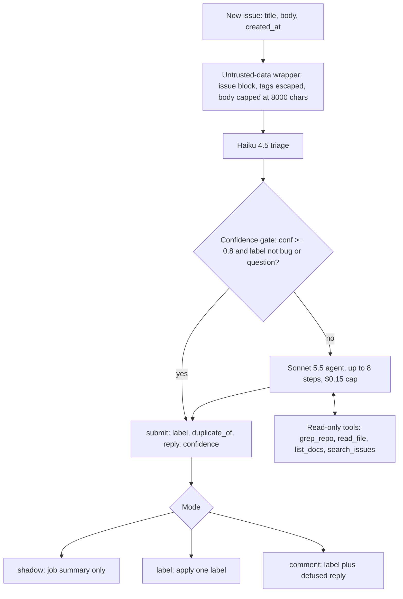
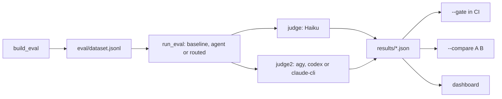
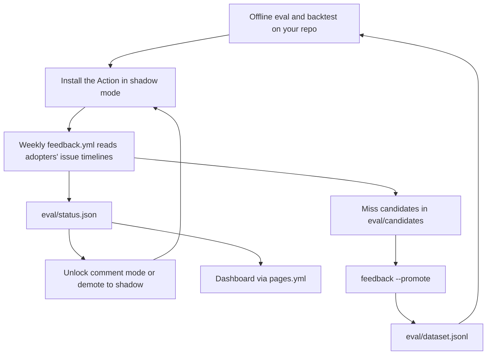

# issuebot

An agent that triages new GitHub issues and drafts the first maintainer reply. It ships with an eval harness that scores it on real closed issues without letting it see anything from after each issue was opened.

[](https://github.com/ayushap18/issuebot/actions/workflows/test.yml)
[](https://github.com/ayushap18/issuebot/actions/workflows/pages.yml)
[](LICENSE)
[](pyproject.toml)
[](https://github.com/ayushap18/issuebot/releases)

**[Dashboard](https://ayushap18.github.io/issuebot/)** · **[Install](#install-on-your-repo)** · **[Eval results](#results)** · **[Scaling plan](SCALING.md)**

## Why

Maintainers spend a lot of time on first responses: bug or usage question, duplicate of #1234, please add a repro, see the docs for `test.pool`. The work is repetitive, but a confidently wrong bot reply does more harm than no reply. So issuebot is built around one question: **how often is the reply right, how often is it confidently wrong, and what does each issue cost?** The eval harness is the main deliverable. The bot is what it measures.

## Highlights

- **Leakage-safe evals.** Each case runs as if the issue had just been opened: the repo is checked out at the last commit before `created_at`, issue search only returns issues created before it (and never the issue itself), and results never include state, labels, comments or `closed_at`. Every guard has an offline unit test.
- **Paired-bootstrap CI gate.** `run_eval --gate` fails a PR only when a metric drops outside the 95% paired-bootstrap CI *and* past a floor (label accuracy -3pts, dup precision -5pts, judge mean -0.2).
- **Cross-model judging.** Claude Haiku grades each draft against the maintainer's real reply. A second judge from another model family (Gemini via `agy`) scores the same replies, and weighted kappa is reported with the results.
- **Replay cache.** Every model call is keyed on the sha256 of the full request. Unchanged cases replay for $0 with no API key, so CI and fork PRs can run the gate.
- **Confidence routing and a per-issue cost cap.** Haiku triages first and Sonnet drafts only when Haiku is unsure or the label needs a real reply. Past $0.15 per issue the loop gets one submit-only step, then stops.
- **Prompt-injection hardening.** Issue text is delimited as untrusted data, tools are read-only and path-guarded, the output is schema-validated, and posted replies have mentions, images, off-repo links and cross-repo refs defused.
- **Per-repo unlock and demotion.** Comment mode unlocks per repo only after labels are kept on 90% of 100 issues. Under 75% the repo drops back to shadow. If the status can't be read, the Action fails closed to label.
- **Subscription-CLI backend.** `ISSUEBOT_BACKEND=claude-cli` runs the agent and judge through `claude -p` with no API key. Tool use is emulated over JSON, so the agent loop is unchanged.

## Results

First measured baseline, on [`vitest-dev/vitest`](https://github.com/vitest-dev/vitest). Dev split, n=40, stratified across gold labels (13 question, 14 bug, 13 feature). Sonnet 5.5 with no tools (`--mode baseline`), run on the `claude-cli` backend. Judged by Haiku 4.5, with Gemini (`agy`) as the second judge. Source: [`results/baseline-cli-dev40.json`](results/baseline-cli-dev40.json).

| Run | Label acc (majority floor) | Macro-F1 | Dup recall | Judge mean | Judge >= 4 | $/issue* | p50 / p95 latency | Judge agreement |
|---|---|---|---|---|---|---|---|---|
| Baseline, Sonnet 5.5, no tools | **55.0%** (35.0%) | 0.539 | n/a** | 2.93 / 5 | 35% | $0.014 agent, $0.028 with judge | 7.1s / 11.4s | weighted kappa 0.70, within-1 89% (n=38) |
| Routed agent, Haiku -> Sonnet with tools | running, results pending | | | | | | | |

\* List-price equivalent reported by the CLI (`total_cost_usd`). The run was billed to a subscription, not per token.
\*\* The committed dataset has no gold duplicates (the 300 rows are 133 question, 122 bug, 45 feature), so dup recall can't be measured on it yet.

What it shows so far:

- The label is right 55% of the time against a 35% majority-class floor. Most errors are questions labeled as bugs (10 of 13 questions).
- Confidence carries signal: at confidence >= 0.8 accuracy is 87.5%, but only 20% of issues reach it. That is the case for `min_confidence = 0.8` in label mode.
- 12.5% of replies are flagged wrong by the judge, and 7.5% are wrong with confidence >= 0.7.
- Accuracy falls from 60% on 2025Q4 issues to 47% on 2026Q1. The newest issues are the least likely to have been seen in pretraining, so the test split is the newest third.
- The judge has not yet been calibrated against hand grades. The kappa above is judge-vs-judge agreement.

**Next.** First the routed agent on the same slice, compared with `--compare`. Then the Stage 3 A/B: the same slice with `--search github` vs `--search fts`. FTS is enabled only if it gains >= 10pts dup recall@5 on dev without hurting test, with the paired-bootstrap CI excluding 0. Otherwise it stays off.

## How it works

### Agent loop



The gate shown is routed mode (`routed = true`). Without it, Sonnet runs the loop directly. Baseline mode is the same prompt and output schema with only the `submit` tool, so agent vs baseline isolates the effect of retrieval. Every run appends one JSON line to `runs/YYYY-MM-DD.jsonl` with the rendered input, each tool call, the output, token usage, cost and latency.

### Eval pipeline



### Lifecycle



## Quickstart

Requires Python 3.13 and `git`.

```bash
git clone https://github.com/ayushap18/issuebot && cd issuebot
python3.13 -m venv .venv && source .venv/bin/activate
pip install -e .
export GITHUB_TOKEN=$(gh auth token)   # REST, search and GraphQL; read-only is enough
```

**API key backend** (default, `ISSUEBOT_BACKEND=api`):

```bash
export ANTHROPIC_API_KEY=...
python -m issuebot.agent --repo vitest-dev/vitest --issue 1234           # prints JSON, posts nothing
python -m issuebot.run_eval --mode baseline --split dev --limit 40 --stratify
python -m issuebot.run_eval --mode routed   --split dev --limit 40 --stratify --threshold 0.8
python -m issuebot.run_eval --compare results/A.json results/B.json
```

**Subscription CLI backend** (no API key; uses `claude -p` on your Claude subscription):

```bash
ISSUEBOT_BACKEND=claude-cli python -m issuebot.agent --repo vitest-dev/vitest --issue 1234
ISSUEBOT_BACKEND=claude-cli python -m issuebot.run_eval --mode baseline --split dev --limit 40 --stratify --judge2 agy
ISSUEBOT_BACKEND=claude-cli python -m issuebot.backtest vitest-dev/vitest --n 20
```

Each CLI call is a fresh run in an empty temp dir with no tools, MCP or settings, and `ANTHROPIC_API_KEY` is stripped from its env so it can't bill the key. `agy` and `codex` are **judge-only** (`ISSUEBOT_JUDGE_BACKEND` or `--judge2`). Neither can turn off its own browsing or shell, so as the agent it could look up how the real issue was resolved. Setting `ISSUEBOT_BACKEND=agy|codex` raises an error.

The committed `eval/dataset.jsonl` has 300 vitest rows (200 dev, 100 test). To rebuild it or build one for another repo (clones once into `~/.cache/issuebot/`):

```bash
python -m issuebot.build_eval --repo vitest-dev/vitest --limit 300 --out eval/dataset.jsonl
```

## Install on your repo

issuebot runs on `issues.opened` as a composite GitHub Action with your own Anthropic key (BYOK). Nothing runs on my side: your key, your Actions minutes, your bill.

**1. Backtest first (optional).** See how it would have done on your last N closed issues before it touches a live one: copy [`examples/issuebot-backtest.yml`](examples/issuebot-backtest.yml) to `.github/workflows/` and run it from the Actions tab, or run `python -m issuebot.backtest owner/repo --n 100` locally. Expect about $5-9 per 100 issues. Public repos only.

**2. Add the workflow.** Copy [`examples/issuebot.yml`](examples/issuebot.yml) to `.github/workflows/issuebot.yml`:

```yaml
name: issuebot
on:
  issues:
    types: [opened]
permissions:
  contents: read
  issues: write   # only used in label/comment modes
concurrency:      # a spam burst queues instead of fanning out
  group: issuebot-${{ github.repository }}
  cancel-in-progress: false
jobs:
  triage:
    runs-on: ubuntu-latest
    steps:
      - uses: actions/checkout@v4
        with:
          fetch-depth: 1
          persist-credentials: false
      - uses: ayushap18/issuebot@v1
        with:
          anthropic-api-key: ${{ secrets.ANTHROPIC_API_KEY }}
```

The job needs exactly `contents: read` and `issues: write`. Keep `persist-credentials: false` so no token lands in `.git/config`, where the read-only tools could see it.

**3. Add the secret.** `gh secret set ANTHROPIC_API_KEY --repo owner/repo`, or Settings > Secrets and variables > Actions.

**4. Set a spend limit.** Give issuebot its own workspace in the Anthropic Console with a monthly spend limit. That is the only hard money cap. `per_issue_cap_usd` and `monthly_issue_cap` bound normal runs, but they are best-effort checks inside a stateless job.

**5. Optionally add a config.** Copy [`examples/issuebot.toml`](examples/issuebot.toml) to `.github/issuebot.toml`. Without it, every key takes its default, which is shadow mode:

```toml
mode = "shadow"              # "shadow" | "label" | "comment"
routed = false               # Haiku triage first, Sonnet only when unsure or label is bug/question
min_confidence = 0.8         # nothing is written to the issue below this
label_prefix = "bot:"        # unmapped labels become bot:bug, bot:feature, ...
per_issue_cap_usd = 0.15
monthly_issue_cap = 0        # 0 = unlimited

[label_map]                  # keys: bug, question, feature, duplicate
# bug = "bug"
```

**6. Promote slowly: shadow, then label, then comment.**

- `shadow` (default): label, duplicate_of, confidence, $ cost, route and the draft reply go to the job summary. Nothing on the issue changes. Read a few weeks of summaries.
- `label`: applies one label at `min_confidence` or above. Unmapped labels get the `bot:` prefix so they never collide with yours. Add `label_map` entries once you trust a class.
- `comment`: also posts the draft reply, with an automated-draft footer and a hidden `<!-- issuebot: {...} -->` marker. It also needs the per-repo unlock (below). Until then the Action runs it as label mode.

To be counted by the feedback loop and the unlock, add your repo to [`adopters.txt`](adopters.txt) with a PR. Adopters send no telemetry. The weekly job reads public issue timelines.

<details>
<summary><b>Action inputs</b></summary>

| Input | Default | Notes |
|---|---|---|
| `anthropic-api-key` | required | |
| `github-token` | `${{ github.token }}` | |
| `config-path` | `.github/issuebot.toml` | relative to the checkout. The default file is optional; a path set here must exist |
| `mode` | config, else `shadow` | blank inputs fall back to the repo config, then the default |
| `model` | `claude-sonnet-5-5` | ignored when routed |
| `min-confidence` | config, else `0.8` | |
| `label-map` | config, else `{}` | JSON form of `label_map`, e.g. `{"bug":"bug"}`; replaces the file's table |
| `max-steps` | `8` | ignored when routed |
| `routed` | config, else `false` | |
| `threshold` | config, else `0.8` | |

</details>

<details>
<summary><b>Config reference</b> (generated from <code>CONFIG</code> in <code>issuebot/agent.py</code>)</summary>

Read with stdlib `tomllib` and validated strictly: an unknown key or a bad value fails the run with a message naming each bad key. Precedence: a set (non-blank) Action input or `ISSUEBOT_*` env var > the file > the default.

| Key | Default | Valid values | Meaning |
|---|---|---|---|
| `mode` | `"shadow"` | `"shadow"`, `"label"` or `"comment"` | shadow = job summary only; label = apply a label; comment = label + post the draft |
| `routed` | `false` | true or false | Haiku triage first; Sonnet drafts only when Haiku confidence < `threshold` or the label is bug/question |
| `threshold` | `0.8` | a number from 0 to 1 | routed-mode confidence gate |
| `min_confidence` | `0.8` | a number from 0 to 1 | nothing is written to the issue below this |
| `label_map` | `{}` | a table from question/bug/duplicate/feature to your label names | a mapped label is applied verbatim |
| `label_prefix` | `"bot:"` | a string | unmapped labels are applied as `label_prefix + label`; `""` = apply only mapped labels |
| `docs` | `["docs"]` | a list of directories | the directories `list_docs` may list |
| `per_issue_cap_usd` | `0.15` | a number > 0 | past this $, the loop gets one submit-only step, then stops (`capped: true`) |
| `monthly_issue_cap` | `0` | an integer >= 0 (0 = unlimited) | skip once more than this many issues were opened this month (one search call; counts all opened issues) |
| `skip_new_accounts_days` | `7` | an integer >= 0 (0 = off) | skip NONE / FIRST_TIME_CONTRIBUTOR / FIRST_TIMER authors whose account is younger than this |
| `search` | `"github"` | `"github"` only | `search_issues` backend. `local` and `fts` need a cached corpus, so they are `--search` on `run_eval` / `backtest` only |

</details>

<details>
<summary><b>Per-repo unlock and auto-demotion</b></summary>

The weekly feedback run keeps each adopter's last 100 scored issues from the last 90 days (`eval/scored.json`) and writes `eval/status.json`:

```json
{"owner/repo": {"kept_rate": 0.93, "n": 100, "status": "comment", "updated": "2026-10-05T06:00:00+00:00"}}
```

| Rule | status |
|---|---|
| n >= 100 and label kept >= 90% | `comment` |
| n >= 20 and label kept < 75% | `shadow` (auto-demoted) |
| otherwise | `label` |

A removed label always counts. A kept label counts only if a maintainer commented or someone other than the author closed the issue, so labels nobody looked at don't unlock comment mode. On every non-shadow run the Action fetches `eval/status.json` from this repo's `main` (5s timeout, override with `ISSUEBOT_STATUS_URL`) and uses the lower of your configured mode and the repo's status. It fails closed: if the fetch fails, the repo isn't listed, or the entry is malformed or more than 21 days old, `comment` runs as `label`.

</details>

## Security model

Issue text is untrusted input from anyone on the internet.

- **Prompt injection.** Title and body sit in an `<issue>` block in the user turn (a literal `<issue` / `</issue>` inside them is escaped), and the system prompt says instructions inside it are data. The body is capped at 8000 chars. Output must parse as `{label, duplicate_of, reply, confidence}`, and `label` must be one of the four known labels. The default mode writes nothing to the issue.
- **Defused replies.** `@` mentions get a zero-width space so they don't ping anyone. Images and off-repo links become inline code (no tracking beacons or phishing links). `owner/repo#N` cross-references are broken so they don't create backlinks.
- **File exfiltration.** All four tools are read-only. `read_file` resolves symlinks and rejects paths outside the checkout, `.git/`, `.env*`, `*.pem` and `*.key`. `grep_repo` excludes the same globs, and `list_docs` only lists the `docs` allowlist.
- **Spam and cost.** Free guards run before any model call: non-`issues.opened` events, pull requests, bot authors, new accounts and the monthly cap all skip. The `concurrency` group serializes bursts (GitHub keeps only one pending run per group, so in a flood some runs are dropped). After that come the per-issue $ cap and your workspace spend limit.
- **Token scope.** `contents: read` + `issues: write` only. The only trigger is `issues.opened`, never `pull_request_target`. Your API key stays in your repo secret and issuebot stores nothing.
- **Dry run.** `ISSUEBOT_DRY_RUN=1` runs the guards, validates the config and renders the prompt, with no model calls and no writes. CI runs the local Action this way on every push.

## All workflows

| File | Trigger | Permissions | What it does | Secrets |
|---|---|---|---|---|
| [`.github/workflows/test.yml`](.github/workflows/test.yml) | push, pull_request | `contents: read` | Offline unit tests, plus `action-smoke`: runs the local Action (`uses: ./`) with `ISSUEBOT_DRY_RUN=1` against `tests/fixtures/issue_opened.json` | none |
| [`.github/workflows/eval-gate.yml`](.github/workflows/eval-gate.yml) | pull_request on `issuebot/**` | `contents: read` | 40-case stratified dev slice, `--gate eval/baseline.json`. Record mode with a key; replay-only from `eval/replay/` without one (fork PRs). Skips with a notice until `eval/baseline.json` is committed | `ANTHROPIC_API_KEY` (optional) |
| [`.github/workflows/feedback.yml`](.github/workflows/feedback.yml) | weekly, Mon 06:00 UTC; manual | `contents: write`, `issues: write` | `python -m issuebot.feedback` over `adopters.txt`; commits `eval/candidates/`, `eval/status.json`, `eval/scored.json`; opens one `Drift: <repo>` issue per drifting repo | none (`GITHUB_TOKEN`) |
| [`.github/workflows/pages.yml`](.github/workflows/pages.yml) | push to main, after `feedback`, manual | `contents: read`; deploy job `pages: write`, `id-token: write` | Builds the dashboard from `results/*.json` + `eval/status.json` and deploys it to GitHub Pages | none |
| [`examples/issuebot.yml`](examples/issuebot.yml) | `issues: [opened]` (in your repo) | `contents: read`, `issues: write` | Runs the Action on each new issue | `ANTHROPIC_API_KEY` |
| [`examples/issuebot-backtest.yml`](examples/issuebot-backtest.yml) | manual, input `n` = 25/50/100/200 | `contents: read`, `issues: read` | Backtests your last N closed issues from the pinned `v1.1.0` tag, caches `cache/`, uploads the results JSON as an artifact | `ANTHROPIC_API_KEY` |

### CLI entrypoints

| Command | What it does |
|---|---|
| `python -m issuebot.agent` | Triage one live issue (`--repo --issue`) or run as the Action (`--event`) |
| `python -m issuebot.build_eval` | Closed issues -> `eval/dataset.jsonl` with gold labels and the SHA at issue time |
| `python -m issuebot.run_eval` | Run, score and judge a dataset slice; compare, gate, calibrate, tag failures |
| `python -m issuebot.backtest owner/repo` | Leakage-safe backtest of one repo's last N closed issues, with a markdown scorecard |
| `python -m issuebot.feedback` | Weekly adopter scoring, miss candidates, drift, per-repo status; `--promote` |
| `python -m issuebot.dashboard` | Static `site/index.html` from results and status |

<details>
<summary><b>All CLI flags</b></summary>

**`issuebot.agent`**

| Flag | Default | Notes |
|---|---|---|
| `--repo owner/name` | | live mode, with `--issue` |
| `--issue N` | | live mode: clones, checks out the SHA before the issue, prints JSON, posts nothing |
| `--event PATH` | | Action mode: issues event payload |
| `--repo-dir DIR` | `.` | checkout used in Action mode |
| `--config PATH` | `$ISSUEBOT_CONFIG`, else `.github/issuebot.toml` | relative to the checkout |
| `--mode shadow\|label\|comment` | `$ISSUEBOT_MODE`, else config | |
| `--model ID` | `$ISSUEBOT_MODEL`, else `claude-sonnet-5-5` | |
| `--max-steps N` | `$ISSUEBOT_MAX_STEPS`, else 8 | |
| `--routed` | `$ISSUEBOT_ROUTED`, else config | Haiku first, Sonnet only when needed |
| `--threshold X` | `$ISSUEBOT_THRESHOLD`, else config (0.8) | |

**`issuebot.run_eval`**

| Flag | Default | Notes |
|---|---|---|
| `--mode agent\|baseline\|routed` | `agent` | baseline = `submit` tool only |
| `--split dev\|test\|all` | `dev` | |
| `--limit N` | all | |
| `--stratify` | off | round-robin `--limit` over gold labels |
| `--model ID` | `claude-sonnet-5-5` | |
| `--threshold X` | 0.8 | routed-mode gate |
| `--search github\|local\|fts` | `github` | `local` / `fts` fetch and cache the repo's issue corpus first |
| `--name NAME` | `<mode>-<model>-<split>-<date>` | writes `results/<name>.json` |
| `--dataset PATH` | `eval/dataset.jsonl` | |
| `--no-judge` | off | |
| `--judge2 agy\|codex\|claude-cli` | off | second judge, adds `metrics.judge_agreement` |
| `--compare A B` | | paired deltas with 95% bootstrap CIs |
| `--gate BASELINE [NEW]` | | exit 1 on a regression outside the CI and past the floor; appends a table to `$GITHUB_STEP_SUMMARY` |
| `--export-grading RESULTS` | | blind hand-grading CSV to stdout (`--n`, default 50) |
| `--calibrate CSV RESULTS` | | judge vs hand grades; exit 1 if weighted kappa < 0.6 |
| `--tag-failures RESULTS` | | tag each failure's cause (`retrieval_miss`, `reasoning`, `taxonomy`, `missing_context`, `other`); prints `STAGE 3 TRIGGER MET` at >= 30% retrieval misses |

**`issuebot.build_eval`**: `--repo` (default `vitest-dev/vitest`), `--limit` (300), `--out` (`eval/dataset.jsonl`), `--branch` (`origin/HEAD`).

**`issuebot.backtest`**: positional `owner/repo`, `--n` (100, capped at 500), `--mode agent|routed` (`agent`), `--search github|local|fts` (`fts`), `--out` (`results/backtest-<owner>__<repo>.json`).

**`issuebot.feedback`**: `--days` (7), `--promote`, `--min` (20, candidates needed to promote), `--force`.

**`issuebot.dashboard`**: `--results` (`results`), `--status` (`eval/status.json`), `--out` (`site`).

</details>

<details>
<summary><b>Environment variables</b></summary>

| Variable | Used by | Meaning |
|---|---|---|
| `ANTHROPIC_API_KEY` | api backend | agent and judge calls |
| `GITHUB_TOKEN` | all | REST, search and GraphQL |
| `ISSUEBOT_BACKEND` | agent, eval | `api` (default) or `claude-cli` |
| `ISSUEBOT_JUDGE_BACKEND` | judge | `api`, `claude-cli`, `agy` or `codex`; defaults to `ISSUEBOT_BACKEND` |
| `ISSUEBOT_REPLAY` | all model calls | `off` (default), `record` or `replay` (fails on a miss) |
| `ISSUEBOT_REPLAY_DIR` | replay cache | default `cache/replay`; CI uses `eval/replay` |
| `ISSUEBOT_CLI_TIMEOUT` | CLI backends | seconds per call, default 300 |
| `ISSUEBOT_AGY_MODEL` | agy judge | default `gemini-3.8-flash-medium` |
| `ISSUEBOT_CODEX_MODEL` | codex judge | default: codex's own config |
| `ISSUEBOT_CONFIG`, `ISSUEBOT_MODE`, `ISSUEBOT_MODEL`, `ISSUEBOT_MIN_CONFIDENCE`, `ISSUEBOT_LABEL_MAP`, `ISSUEBOT_MAX_STEPS`, `ISSUEBOT_ROUTED`, `ISSUEBOT_THRESHOLD` | Action | set from the Action inputs; blank = not set |
| `ISSUEBOT_DRY_RUN` | Action | `1` = guards, config and prompt only |
| `ISSUEBOT_EVENT` | Action | overrides the event payload path |
| `ISSUEBOT_STATUS_URL` | Action | overrides where `eval/status.json` is fetched from |

CLI-backend `$` figures are list-price equivalents, not what you are billed. `agy` and `codex` report no price, so their `$` is 0. Don't compare CLI cost columns against API runs as spend. The backend is part of the replay cache key.

</details>

<details>
<summary><b>Eval methodology</b></summary>

**Dataset.** `build_eval` keeps a closed issue only if it was filed by a non-maintainer, non-bot user, has a body, is at least 14 days old, and got a reply of 40+ chars from an `OWNER` / `MEMBER` / `COLLABORATOR`. That reply is the reference answer. Gold labels, applied in order:

| Label | Rule |
|---|---|
| duplicate | `state_reason == duplicate`, a `duplicate` label, or a maintainer comment like "duplicate of / same as / tracked in #N". Dropped if there's no number or it points to a later issue |
| feature | `enhancement`, `enhancement: pending triage` or `p2-nice-to-have` |
| bug | `p2-edge-case`, `p3-minor-bug`, `p3-significant`, `p4-important`, `p5-urgent`, `upstream` or `needs reproduction` |
| question | everything else |

Rows are sorted by `created_at`: the oldest two thirds are `dev`, the newest third `test`. A `label_override` field holds hand labels, and scoring uses `label_override or gold_label`.

**Leakage guards.** (1) Code and docs are frozen at the last first-parent commit before `created_at`, and `grep_repo` only sees files tracked at that commit. (2) `search_issues` adds `created:<created_at`, rechecks dates locally (the model writes the query and could widen it), and drops the issue's own number. (3) Search results carry only number, date, title and a 400-char snippet. (4) The title is the pre-rename one, and rows whose body was edited after the first maintainer comment are dropped. (5) A duplicate pointing to a later issue is dropped. Known remaining leakage: older issue bodies may have been edited later, and the model may have seen public issues in pretraining. Per-quarter scores make that visible.

**Metrics** (`results/<name>.json`): `label_accuracy` next to `majority_floor`, `macro_f1`, `dup_precision` / `dup_recall` (exact `duplicate_of` match), `dup_recall_at5` (gold original in the top 5 of any search the agent ran), `judge_mean` / `judge_ge4` (1-5 vs the maintainer reply), `wrong_rate` / `confidently_wrong` (wrong and confidence >= 0.7), `acc_at_0.8` / `coverage_at_0.8`, `cost_per_issue`, latency p50/p95, `avg_steps`, `error_rate`, `by_quarter`, and `judge_agreement` with `--judge2`.

**Issue search backends** (`--search`): `github` uses the search API (<= 25/min, honors `retry-after`). `local` matches every term against a cached REST corpus (`cache/corpus-<owner>__<repo>.json`). `fts` uses an SQLite FTS5 index (`cache/fts-<owner>__<repo>.sqlite`, bm25-ranked, query words quoted so model-written queries can't inject operators). All three enforce the same date cutoff.

**Gate baseline.** By convention the gate compares against `eval/baseline.json`, and its replay cache is `eval/replay/`:

```bash
ISSUEBOT_REPLAY=record ISSUEBOT_REPLAY_DIR=eval/replay \
  python -m issuebot.run_eval --split dev --limit 40 --stratify --name baseline
cp results/baseline.json eval/baseline.json
```

</details>

## Project layout

```
issuebot/
  agent.py        model ids + prices, CONFIG validator, system prompt, agent loop, routing, Action entrypoint
  tools.py        GitHub REST helper, clone / sha_at / checkout, the 4 tools, FTS5 index, submit schema
  cli.py          subscription-CLI backend (claude -p agent + judge; agy / codex judge only)
  judge.py        LLM-as-judge vs the maintainer's reply, failure-cause tagger
  build_eval.py   closed issues -> eval/dataset.jsonl
  run_eval.py     run + score, --compare, --gate, --export-grading / --calibrate, --tag-failures
  backtest.py     one repo's last N closed issues, cached corpus, scorecard
  feedback.py     weekly adopter scoring, miss candidates, drift, per-repo status, --promote
  dashboard.py    static site from results/*.json + eval/status.json
tests/            offline unittest suite (fake Anthropic client, httpx.MockTransport, temp git repos)
eval/             dataset.jsonl, replay/ cache; status.json + scored.json from the feedback run
results/          committed result files
examples/         issuebot.yml, issuebot-backtest.yml, issuebot.toml
.github/workflows test.yml, eval-gate.yml, feedback.yml, pages.yml
action.yml        composite GitHub Action
adopters.txt      repos the feedback loop reads
PLAN.md           build plan and design decisions
SCALING.md        stage-by-stage scaling plan with triggers and costs
```

## Roadmap

Stages and their measured triggers are in [SCALING.md](SCALING.md).

**Stage 0: one repo, eval-gated**
- [x] Record/replay cache, per-issue $0.15 cap, Haiku-first routed mode
- [x] Paired-bootstrap CI gate on a 40-case stratified slice (`eval-gate.yml`)
- [x] Judge calibration tooling (`--export-grading`, `--calibrate`) and cross-model `--judge2`
- [x] 300-row vitest dataset and first baseline (`results/baseline-cli-dev40.json`)
- [ ] Routed-agent results; commit `eval/baseline.json` so the gate runs instead of skipping
- [ ] Hand-grade 50 replies and calibrate the judge (kappa >= 0.6); one final run on the test split

**Stage 1: reusable Action, BYOK**
- [x] Composite Action, strictly validated `.github/issuebot.toml`, free guards, injection hardening, dry-run smoke test
- [x] Weekly feedback loop over `adopters.txt`: label-kept agreement, miss candidates, drift issues, `--promote`
- [x] `v1` / `v1.1.0` tagged
- [ ] Shadow install on 1-3 live repos

**Stage 2: multi-repo**
- [x] `issuebot.backtest` with cached corpus and scorecard; `examples/issuebot-backtest.yml`
- [x] Per-repo unlock/demote via `eval/status.json`, fail closed
- [x] Static dashboard on GitHub Pages, worst repo first
- [ ] Published backtest scorecards for 3-5 popular repos; Marketplace listing

**Stage 3: retrieval, only if evals prove it**
- [x] SQLite FTS5 issue index behind `--search github|local|fts`, `dup_recall_at5` metric
- [ ] github vs fts A/B; enable per repo only on a >= 10pt dup recall@5 gain without hurting test

**Stage 4: hosted GitHub App: not planned.** It gets built only if maintainers measurably refuse BYOK (3+ refuse a key or workflow, or an org wants 5+ repos). BYOK costs me $0 per extra repo and leaves no server to run. Even then it would be label-only, hard-capped, and would never store anyone's API key. Until then the time goes into evals.

## Contributing and tests

The test suite is offline: no network, no API key.

```bash
python -m unittest discover -s tests
```

Changes under `issuebot/**` also go through the eval gate. A change counts as an improvement only if `--compare` shows a CI that excludes 0, and each results file should differ from its baseline by one change.

## License

MIT. See [LICENSE](LICENSE).
